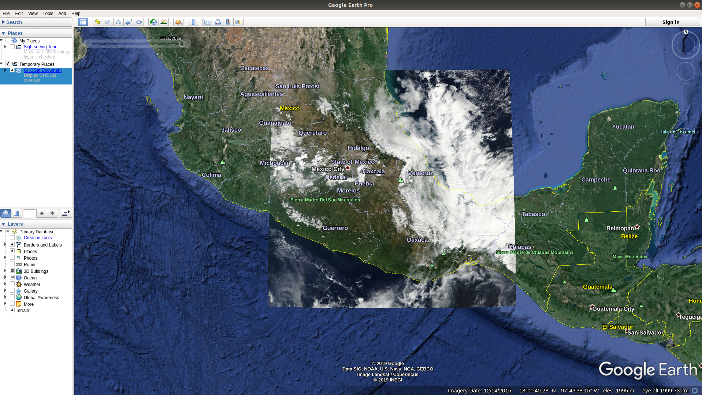

==========================
Observation Management API
==========================

This repository is hosting the API built for GHGSat challenge linked bellow

`Link to the challenge <https://github.com/GHGSat/tech-challenge/blob/master/webdev/README.md#challenge-3-observation-management>`_

.. image:: icons/map-24px.svg
    :width: 24px
    :align: left
    :height: 24px
    :alt: map

***************
API Description
***************

This GIS API let you:

#. Create Geospacial targets.
#. Create timestamped image observations associated to a specific target.
#. You can retrieve targets within a given coordinated bouding box.
#. You can retrieve observations within a given coordinated bounding box and within a specific period of time.

.. image:: icons/done-24px.svg
    :width: 24px
    :align: left
    :height: 24px
    :alt: info

************
Requirements
************

Download and install Docker and docker-compose

The following versions where used during the build of this project:

#. Docker version 19.03.5, build 633a0ea838
#. docker-compose version 1.17.1

.. image:: icons/info-24px.svg
    :width: 24px
    :align: left
    :height: 24px
    :alt: info

************
Installation
************

* cd observation-management-api
* docker-compose up -d --build
* Navigate to http://localhost:8000/

.. image:: icons/http-24px.svg
    :width: 24px
    :align: left
    :height: 24px
    :alt: info

*****
Usage
*****

Using a REST Client or Curl command you can use the API at the following endpoints with specific parameters

For testing purpose you can use images from https://worldview.earthdata.nasa.gov/ (To prepare the images see tips at the end of the documentation)

To create a new target
######################

Request
*******

/targets/

.. sourcecode:: json

        curl -X POST -H 'Content-Type: application/json' -i http://localhost:8000/targets/ --data '
        {
            "name": "Target 1",
            "coordinates": "POINT(-34.345345345 29.5654654)",
            "elevation": 500
        }'

Where coordinates is given in OGC WKT format https://en.wikipedia.org/wiki/Well-known_text_representation_of_geometry

Response
********

The response data is in json format:

.. sourcecode:: json

    {
        "id": 43,
        "name": "Target 1",
        "coordinates": "SRID=4326;POINT (-34.345345345 29.5654654)",
        "elevation": 500,
        "observations": []
    }

To create a new observation
###########################

Request
*******

/observations/

.. sourcecode:: json

    curl -X POST -H 'Content-Type: application/json' -i http://localhost:8000/observations/ --data '{
        "image_url": "https://wvs.earthdata.nasa.gov/api/v1/snapshot?REQUEST=GetSnapshot&TIME=2019-10-08T00:00:00Z&BBOX=33.167724609375,-7.9200439453125,33.802734375,-7.213623046875&CRS=EPSG:4326&LAYERS=VIIRS_SNPP_CorrectedReflectance_TrueColor,Coastlines,Reference_Features,Reference_Labels&WRAP=day,x,x,x&FORMAT=image/jpeg&WIDTH=643&HEIGHT=578&ts=1579645310910",
        "timestamp": "2019-06-27 22:00:33",
        "target": 43
    }'

Where timestamp has to respect the "YYYY-MM-DD HH:mm:ss" format

Response
********

The response data is in json format:

.. sourcecode:: json

    {
        "id": 44,
        "image_url": "https://wvs.earthdata.nasa.gov/api/v1/snapshot?REQUEST=GetSnapshot&TIME=2019-10-08T00:00:00Z&BBOX=33.167724609375,-7.9200439453125,33.802734375,-7.213623046875&CRS=EPSG:4326&LAYERS=VIIRS_SNPP_CorrectedReflectance_TrueColor,Coastlines,Reference_Features,Reference_Labels&WRAP=day,x,x,x&FORMAT=image/jpeg&WIDTH=643&HEIGHT=578&ts=1579645310910",
        "timestamp": "2019-06-27T22:00:33Z",
        "target": 43
    }

To search targets
#################

/search_targets/

Request
*******

.. sourcecode:: json

    curl -X GET -i 'http://localhost:8000/search_targets/?bounding_box=POLYGON((-74.150848 45.265222, -73.355713 45.790509, -73.355713 45.265222, -74.150848 45.265222, -74.150848 45.265222))'

Response
********

.. sourcecode:: json

    {
        "count": 2,
        "next": null,
        "previous": null,
        "results": [
            {
            "id": 3,
            "name": "Target 3",
            "coordinates": "SRID=4326;POINT (-73.447013 45.332695)",
            "elevation": 10,
            "observations": []
            },
            {
            "id": 2,
            "name": "Target 2",
            "coordinates": "SRID=4326;POINT (-73.52874799999999 45.628445)",
            "elevation": 10,
            "observations": [
                {
                "id": 3,
                "image_url": "https://wvs.earthdata.nasa.gov/api/v1/snapshot?REQUEST=GetSnapshot&LAYERS=MODIS_Terra_CorrectedReflectance_TrueColor&CRS=EPSG:4326&TIME=2020-01-22&WRAP=DAY&BBOX=44.145813,-68.884277,44.859924,-68.05481&FORMAT=image/jpeg&WIDTH=9&HEIGHT=8&AUTOSCALE=TRUE&ts=1579716290548",
                "image_polygon": "SRID=4326;POLYGON ((44.145813 -68.884277, 44.145813 -68.05481, 44.859924 -68.05481, 44.859924 -68.884277, 44.145813 -68.884277))",
                "timestamp": "2020-01-22T12:00:00Z",
                "target": 2
                }
            ]
            }
        ]
    }

To search targets and get KML file
##################################

/search_targets/kml/

Request
*******

.. sourcecode:: json

    curl -G "http://localhost:8000/search_targets/kml/" --data-urlencode "bounding_box=POLYGON((-74.150848 45.265222, -73.355713 45.790509, -73.355713 45.265222, -74.150848 45.265222, -74.150848 45.265222))"

Response
********

You can paste this kml structure to a file and open it on Google Earth

.. sourcecode:: xml

    <kml xmlns="http://www.opengis.net/kml/2.2">
        <Document id="docid">
            <name>GHGSat Document</name>
            <description>Display GHGSat targets</description>
            <visibility>1</visibility>
            <Folder id="folder1">
            <name>Targets</name>
            <description>Targets features</description>
            <visibility>1</visibility>
            <Placemark id="1">
                <name>Target 1</name>
                <description>description</description>
                <visibility>1</visibility>
                <Point>
                <coordinates>-73.647013,45.532695,10.000000</coordinates>
                </Point>
            </Placemark>
            </Folder>
        </Document>
    </kml>

To search observations
######################

/search_observations/

Request
*******

.. sourcecode:: json

        curl -X GET -i 'http://localhost:8000/search_observations/?bounding_box=POLYGON((44.947815 -73.844604,44.947815 -70.883789,47.106628 -70.883789,47.106628 -73.844604,44.947815 -73.844604))&start_timestamp=2020-01-21T12:00:00Z&end_timestamp=2020-01-23T12:00:00Z'

Response
********

.. sourcecode:: json

    {
        "count": 2,
        "next": null,
        "previous": null,
        "results": [
            {
            "id": 2,
            "image_url": "https://wvs.earthdata.nasa.gov/api/v1/snapshot?REQUEST=GetSnapshot&LAYERS=MODIS_Terra_CorrectedReflectance_TrueColor&CRS=EPSG:4326&TIME=2020-01-22&WRAP=DAY&BBOX=46.073914,-72.800903,46.842957,-71.817627&FORMAT=image/jpeg&WIDTH=11&HEIGHT=9&AUTOSCALE=TRUE&ts=1579716136183",
            "image_polygon": "SRID=4326;POLYGON ((46.073914 -72.80090300000001, 46.073914 -71.817627, 46.842957 -71.817627, 46.842957 -72.80090300000001, 46.073914 -72.80090300000001))",
            "timestamp": "2020-01-22T12:00:00Z",
            "target": 1
            },
            {
            "id": 1,
            "image_url": "https://wvs.earthdata.nasa.gov/api/v1/snapshot?REQUEST=GetSnapshot&TIME=2019-09-01T00:00:00Z&BBOX=45.23071289062499,-74.063232421875,45.97778320312499,-73.212890625&CRS=EPSG:4326&LAYERS=VIIRS_SNPP_CorrectedReflectance_TrueColor,Coastlines,Reference_Features,Reference_Labels&WRAP=day,x,x,x&FORMAT=image/jpeg&WIDTH=387&HEIGHT=340&ts=1579625691168",
            "image_polygon": "SRID=4326;POLYGON ((45.77179 -73.410645, 45.77179 -72.339478, 46.551819 -72.339478, 46.551819 -73.410645, 45.77179 -73.410645))",
            "timestamp": "2020-01-22T12:00:00Z",
            "target": 1
            }
        ]
    }

To search observations and get KML file
#######################################

/search_observations/kml/

Request
*******

.. sourcecode:: json

        curl -G "http://localhost:8000/search_observations/kml/" --data-urlencode "bounding_box=POLYGON((14.765625 -101.8828125, 14.765625 -93.287109375, 22.728515625 -93.287109375, 22.728515625 -101.8828125, 14.765625 -101.8828125))" --data-urlencode "start_timestamp=2019-11-15T00:00:00Z" --data-urlencode "end_timestamp=2019-11-17T00:00:00Z"

Response
********

You can paste this kml structure to a file and open it on Google Earth

.. sourcecode:: xml

    <kml xmlns="http://www.opengis.net/kml/2.2">
        <Document id="docid">
            <name>GHGSat Document</name>
            <description>Display GHGSat overlays</description>
            <visibility>1</visibility>
            <Folder id="folder1">
                <name>Ground Overlays</name>
                <description>Bouding box Ground overlays</description>
                <visibility>1</visibility>
        
                <GroundOverlay>
                    <name>Target 1</name>
                    <visibility>1</visibility>
                    <description>Overlay Description.</description>
                    <Icon>
                        <href>https://i.postimg.cc/x8gfngVc/2019-11-16-T00-00-00-Z.jpg</href>
                    </Icon>
                    <LatLonBox>
                        <north>14.765625</north>
                        <south>22.728515625</south>
                        <east> -101.8828125</east>
                        <west> -93.287109375</west>
                    </LatLonBox>
                    <TimeStamp>
                    <when>2019-11-16 00:00:00+00:00</when>
                    </TimeStamp>
                </GroundOverlay>
                
            </Folder>
        </Document>
    </kml>

*************
Execute Tests
*************

To execute tests execute the following commands:

* cd observation-management-api
* docker-compose -f docker-compose.yml exec web python manage.py test

*********************************
How to use Nasa images as samples
*********************************

The Wordlview tool is a powerfull imagery plateform!

https://worldview.earthdata.nasa.gov/

When capturing an image the provided link contains:

https://wvs.earthdata.nasa.gov/api/v1/snapshot?

REQUEST=GetSnapshot

&LAYERS=MODIS_Terra_CorrectedReflectance_TrueColor

&CRS=EPSG:4326

&TIME=2020-01-22

&WRAP=DAY

&BBOX=45.77179,-73.410645,46.551819,-72.339478

&FORMAT=image/jpeg&WIDTH=12&HEIGHT=9&AUTOSCALE=TRUE&ts=1579714424926

* the Bounding Box coordinates: BBOX=45.77179,-73.410645,46.551819,-72.339478
* the timestamp: TIME=2020-01-22

Also I download the image and upload it to a server to get a remote image path with the .jpg extension

*****************************
Convert bbox to a WKT POLYGON
*****************************

To convert the bbox to a polygon use the following script in a Django environement:

.. sourcecode:: python

    from django.contrib.gis.gdal import Envelope 
    bbox = (45.77179,-73.410645,46.551819,-72.339478)
    Envelope(bbox).wkt

This will generate a POLYGON in the WKT format that you can use in this API:

'POLYGON((45.77179 -73.410645,45.77179 -72.339478,46.551819 -72.339478,46.551819 -73.410645,45.77179 -73.410645))'